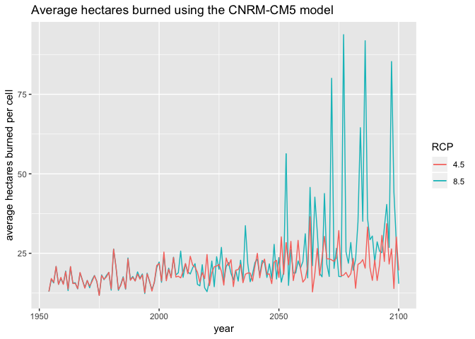

How differing climate scenarios affect wildfire impacts on California
endangered species
================
Grace Pratt

Wildfire has long been a part of the California landscape. Both natural
and human caused fires have shaped the landscape and created unique
ecosystems that depend on fire to maintain ecosystem processes. Many
species in California are pyrogenic, meaning they tolerate or require
fire for their life cycle. However, over the last century, humans have
worked to suppress the previous fire regimes. Fire suppression has led
to increased biomass fuel in many ecosystems, [increasing fire severity
when fires do occur in
California](http://p8888-ucelinks.cdlib.org.libproxy.berkeley.edu/sfx_local?isbn=9780520246058&title=Fire+in+California%E2%80%99s+Ecosystems&genre=book&sid=jstor%3Ajstor&eisbn=9780520932272#).

In the future, climate change will increase wildfire frequency and
severity in California. As the fire regime in Calfornia changes again,
it will be important to consider the impacts [on both humans and
wildlife](http://climateassessment.ca.gov/techreports/docs/20180827-Projections_CCCA4-CEC-2018-014.pdf).

### This project

For this project I will answer these 3 questions: 1. How do predicted
wildfire scenarios differ between the CNRM-CM5 and HadGEM2-ES climate
models? 2. Where in California do we expect increases in wildfires? 3.
How will the habitats of California endangered species be affected by
future climate scenarios?

## Modeling Future Wildfire Scenarios

In order to predict future wildfire regimes, climate scientists have
created models outlining potential future climate change scenarios.
These models are then used to simulate fire regimes.

[Cal-Adapt](https://cal-adapt.org/) provides data to give insight into
how climate change could affect California at a local level, including
how climate change could impact fire. Cal-Adapt provides data on the
impacts of climate change for 4 different climate models: CanESM2,
CNRM-CM5, HadGEM2, and MIROC5, which model physical processes and
reactions to increasing CO2 levels. Cal-Adapt also provides data for 2
different Representative Concentration Pathways (RCP): 4.5 and 8.5,
which represent different projections of CO2 in our atmosphere. These
models create projections for California from 1954-2100.

### Models used in this analysis

For this project, I wanted to compare how different models predicted
future California wildfires. To have a comparison between models that
were very different, I decided to compare the CNRM-CM5 climate model,
which generally has cooler and wetter predictions for future California
climates, and the HadGEM2-ES model, which includes higher and drier
predictions.

In order to ensure that my data is up to date, I will use the Cal-Adapt
API to access the data. Here, the data is raster files modeling hectares
burned per cell under each climate model and RCP scenario. In total, I
will be looking at 4 different scenarios: HadGEM2 4.5, HadGEM2 8.5,
CNRM-CM5 4.5, and CNRM-CM5 8.5.

## Initial Visualizations of Wildfire Scenarios

In order to get a sense of how the scenarios differ, I extracted the
average and maximum hectares burned for each raster for each year. Here
you can see the plots comparing the different scenarios.

<!-- -->

<!-- -->

As we can see, the CNRM model overall had higher averages for hectares
burned when compared to the HadGEM2 model. The CNRM model was much more
sensitive to changes in the RCP.

### Exploring the 8.5 RCP Scenarios

Drought scenarios heavily influence wildfire regimes, and California is
very likely to expereience extended droughts in the future. For this
analysis, I want to see how drought could potentially impact future
wildfires. In these climate models, the RCP 8.5 scenario in the HadGEM2
model shows a drought occuring in California from roughly 2051-2070. In
order to make the scope of the analysis more digestible and have the
ability to analyze the effects of drought, I will be further analyzing
only the RCP 8.5 scenarios.

First, I want to explore how the 8.5 scenarios differ for the 2 climate
models overtime.

<!-- -->

We can see from this graph again that the HadGEM2 had some years of high
average area burned more consistently across tine, while the CNRM model
shows sharp increases in wildfire after 2050. Another important note to
make is that these are models. **All data shown is modeled data,
including values in the past (which is why there are different values
for average area burned). The only real recorded data included (data
that is not a modeled projection) are the atmostpheric concentrations of
CO2 from 1954–2005**

However, wildfire is not experienced as an average across the entire
state, some areas will experience much more burning than others. In
order to see the extreme values, we can take a look at the max value for
hectares burned in a single cell for both models.

<!-- -->

Overall, we can see that, while the HadGEM2 shows some extreme values
throughout. However, compared to looking at the averages, the models
match much more closely for their respecitve max values and show similar
trajectories after 2050.

## Where will fire occur?

While we can gather a lot of info from just observing the differences in
the average and max hectares burned per cell, this doesn’t tell us
anything about where in California these fires will occur. In order to
see where in California fires will occur over time, we can plot the
rasters of the area burned per cell.

In order to make easier comparisons across time, I averaged the value
for each cell over each decade starting in 1960.

<!-- -->

<!-- -->

Overall, we can see that for both scenarios there there are larger fires
in the Sierra Nevada mountain range and in other forested areas of
Northern California. We can also see that the amount of area burned in
the Sierras and forests is expected to increase more over time compared
to other areas of the state for both models.

In order to directly compare the spatial differences between the 2
models we can plot their differences between them. Here, the bluer tones
reflect areas where the HadGEM2 model predicted more wildfire, while
redder tones show areas where the CNRM predicted more fire.

<!-- -->

We can see that most of the time, the models predicted the same spatial
variation of wildfire. However, we can see that overall, the HadGEM2
tended to predict more wildfire in northern California, particularly in
the northwest.

## Impacts of Fire on Endangered Species

There is a major concern about the effect of wildfires on species in
California, particularly endangered species. Although many species,
including endangered species, will be impacted by wildfire, I wanted to
focus my efforts on analyzing 2 of the endangered species that are
predicted to be negatively impacted by wildfire: the Sierra Nevada
Yellow-Legged Frog and the California Condor.

There is a lot to unpack when it comes to predicting the impacts of fire
on species including fire location, severity, and duration. I will focus
on fire location since that is that is what data exists for.
Specifically, I will focus on the amount of burned area predicted within
the critical habitats of each species. Shapefiles for the critical
habitats are available from the [US Fish and Wildlife
Service](https://ecos.fws.gov/ecp/report/table/critical-habitat.html).

### Sierra Nevada Yellow-Legged Frog

The Sierra Nevada yellow-legged frog is found across the Sierra Nevada
mountain range. While these species were once abundant in alpine lakes
and streams, due to the [introduction of foreign fish and pathogenic
chytrid fungus](https://www.nps.gov/yose/learn/nature/snylfrog.htm) this
species is now federally endangered.

If this species was abundant, then biologists would not be as concerned
with how fires could impact this species. However, given the
vulnerabilty of the species, scientists are concerned with the impacts
that fire and, more importantly, fire fighting [could have on the
species](https://www.fs.usda.gov/Internet/FSE_DOCUMENTS/stelprd3811864.pdf).

While there have not been any empirical studies on the yellow-legged
frog specifically, fire fighters can take water from pools and streams
where frogs reside, which can [place
stress](https://www.fs.usda.gov/Internet/FSE_DOCUMENTS/stelprd3811864.pdf)
on these frogs and other species . This is a trend that could continue
or even expand [given current political
trends](https://abc7news.com/politics/trump-directs-agencies-to-override-protections-for-ca-endangered-species/3912323/).
Another concern for the yellow-legged frog is the widespread release of
flame retardant, particularly [sodium
ferrocyanide](https://www.fs.usda.gov/Internet/FSE_DOCUMENTS/stelprd3811864.pdf),
which is highly toxic to amphibians .

Firstly, in order to verify that the yellow-legged frog lives in areas
expected to be affected by wildfire in both models in the future, I will
plot the critical habitat of the species over the 2090s raster of the
HadGEM2 vs. CNRM models.

<!-- -->

We can already see that the frog’s habitat is more affected in the CNRM
model. In order to see how wildfire will increase or decrease in
yellow-legged frog habitat over time, I will plot the total area burned
in the species’ critical habitat during each decade.

<!-- -->

Given the current projections for increases in fire in the critical
habitat of the yellow-legged frog, it’s important to further study the
effects of fires on these species.

### California Condor

The California condor is one of the largest flying birds in the world.
However, in the the 19th and 20th centuries, their numbers dropped so
severely that they were considered to be extinct in the wild in 1987.
Luckily, scientists were able to rehabilitate captive birds and began
rereleasing them in 1992.

Due to current scientific monitoring of the species, much is now known
about what threatens condor populations. The largest threat to condors
is lead polution, but the third largest threat to condors is wildfire.
Therefore it is important to consider how wildfire will change in
[condor
habitats](https://www.sciencenews.org/blog/wild-things/wildfires-are-unexpected-threat-california-condors)
in the future.

Again, I will start by plotting the critical habitat over the
    raster.

    ## Variable "layer.2" contains positive and negative values, so midpoint is set to 0. Set midpoint = NA to show the full spectrum of the color palette.

<!-- -->

This time, we can see that there is a smaller difference between the
models in the condor habitat. We will see if this is consistent over
time using a bar graph.

<!-- -->

As we can see, there is not likely going to be extreme increases in fire
in California condor habitat. However, given our current knowledge of
wildfire threats to the condor and projected increases in wildfire in
condor critical habitat, it will still be imporant to monitor condors in
this area and take precautions to reduce wildfire risk.
